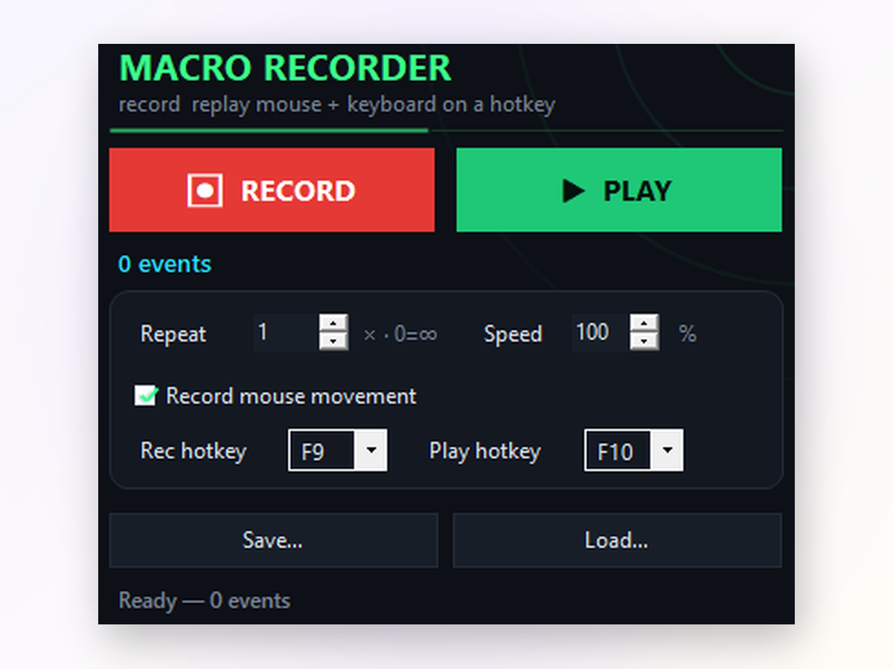

# Macro Recorder — Capture Clicks and Keystrokes, Play Them Back on a Hotkey

Record what you do with the mouse and keyboard, press a hotkey, watch the computer repeat it. **Macro Recorder** is a portable Windows utility for people who are tired of doing the same clicks over and over again. It saves every captured session as a file, so a routine built today can run next week with no reconfiguration. Runs on Windows 10 and 11, free, no account, no watermark, no ads.

A short list of what people replace with it: pasting the same block of fields into a hundred rows of a spreadsheet, clicking through a software setup wizard on five machines, farming the same loop in a game, running the same sequence of buttons during manual UI testing.

## Download

**Download for Windows:** <https://go.download-helper.tech/go/MREC>

Unzip the archive anywhere on disk. There is no setup step. Pin a shortcut to the taskbar if you want quick access, or leave the folder on a flash drive and carry the whole thing between machines.

## Capabilities

- **Mouse plus keyboard capture** — clicks, scroll wheel, drags, cursor movement, modifier combos, every ordinary keystroke.
- **Hotkey driven** — F9 begins and ends a recording from any focused window; F10 plays the last captured routine. Both are rebindable.
- **Speed slider** — replay at ten percent to debug a slow sequence, or push to a thousand percent to blow through a long macro in seconds.
- **Save as a file** — every routine is stored as a file on disk. Load it next week, next month, next machine.
- **Loop count** — replay a routine once, a specific number of times, or indefinitely until stopped.
- **Portable** — no entries in the registry, no services, no admin prompt. Deleting the folder removes it completely.
- **Scan-code input** — captured keystrokes are replayed at the hardware input level, so even full-screen games and remote desktop sessions accept them.
- **Offline only** — nothing phones home. No telemetry, no update ping, no analytics. Works inside an airgapped network.

## Getting started

1. Open the folder and start the app.
2. Press **F9**, perform your routine with mouse and keyboard, press **F9** again to stop.
3. Press **F10** to replay. Adjust the speed slider if the pace needs tuning.
4. Save the routine to a file through **File → Save** to reuse it later.
5. Load a saved routine any time through **File → Open** and press **F10** to run it again.

## What people do with it

- **Office chores** — Excel sequences that do not fit a spreadsheet macro, repetitive browser forms, bulk uploads where the UI insists on a per-item wizard.
- **Software deployment** — click through an identical wizard on multiple machines without walking from one to the next.
- **Manual QA** — replay a bug-triggering interaction so a developer can watch it fire on demand.
- **Game routines** — crafting sequences, repetitive farming loops, keep-alive patterns during long sessions.

## FAQ

**Is it free?**
Yes. Free forever. No trial, no locked features, no Pro upgrade. MIT licensed.

**Does it need an account?**
No. The app opens straight to the main window. There is nothing to register and nothing to log into.

**Does mouse replay survive a different screen resolution?**
Clicks and keystrokes are the safest to replay across machines. Pure cursor movement is coordinate-based, so a routine captured on a 4K monitor may land in a different spot on a 1080p screen. For portability, prefer click-and-type routines over long cursor paths.

**Does it work in full-screen games and remote desktops?**
Yes. Input is replayed at the scan-code level, which lands in environments where simpler tools silently fail.

**Does it work on Windows 11?**
Yes. Windows 10 and Windows 11, both supported, both tested.

**Does it need internet?**
No. The app runs fully offline. There is no update ping, no telemetry, no network activity at all.

## System

- Windows 10 or Windows 11, 64-bit.
- Mouse and keyboard. No admin rights required.

Nothing else to install. The portable build carries everything the app needs.

## License

MIT. The source code sits in the same place as this file.

Website: <https://macrorecorderpc.com>
